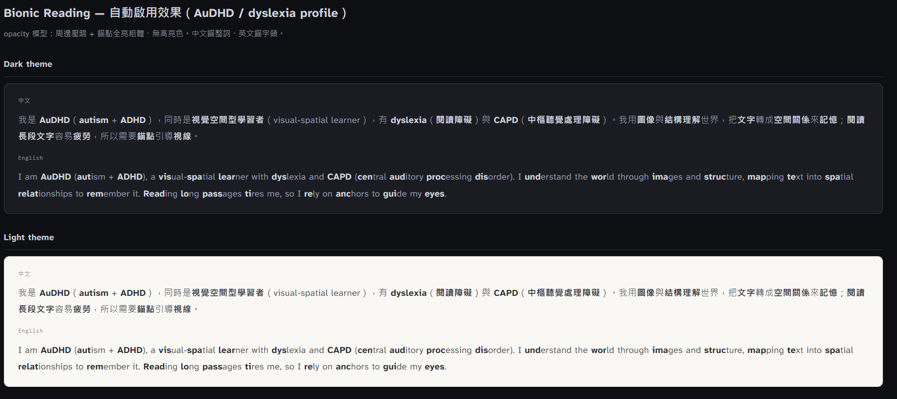

# 🧠 Claude Prompt & Skill Library for Neurodivergents (ND)

[](https://opensource.org)
[](https://anthropic.com)

---

## 🌐 English Version

A collection of Claude Prompts and Skills tailored for Neurodivergent (ND) individuals (including ADHD, ASD, Dyslexia, etc.). 

We leverage AI's structuring capabilities to **reduce everyday cognitive load and mitigate executive dysfunction**. All outputs from this library strictly adhere to accessibility guidelines, featuring profile-driven Bionic Reading and clear typography.

### 🛠️ Current Core Skills
*   **📐 [Doc Style Framework](./skills/doc_style_framework):** A high-legibility document presentation system featuring an automated format complexity analyzer (Markdown vs. Styled HTML), Bionic Reading triggers, and built-in machine-readable `AI-SUMMARY` blocks for doc↔code synchronization.

### 📂 Directory Structure
```text
├── skills/
│   └── doc_style_framework/   # Core document presentation framework
│       ├── skill.json         # Metadata config for Claude
│       ├── prompt.md          # Core styling & formatting rules
│       └── README.md          # Skill-specific usage guide
├── CLAUDE.md                      # Global instructions (Triggers Bionic Reading)
└── README.md                      # This main page
```

### 🚀 Quick Start
*   **Manual Copy:** Copy the contents of `prompt.md` from the desired skill folder and paste it into your Claude Project's Custom Instructions or chat box.
*   **Claude Code / Desktop Integration:** Symlink the skill directory to your local Claude environment:
    ```bash
    git clone https://github.com
    cd your-repo-name
    ln -s "$(pwd)/skills/doc_style_framework" ~/.claude/skills/doc_style_framework
    ```

### Trigger Conditions

#### A. When the global protocol is active (`CLAUDE.md` configured with ND profile):
Apply this skill seamlessly when the user requests any of the following:
*   An HTML document output
*   Phrases like: *"doc style"*, or *"doc style framework"*
*   A flow diagram in HTML or SVG format
*   A conversion from Markdown to styled HTML
*   A diagram depicting role, document, or process flows

#### B. When the global protocol is inactive (`CLAUDE.md` not configured):
If the user requests document generation but no ND profile is globally active, the output **MUST explicitly ask or inform the user** whether they want to toggle and apply **Bionic Reading** before rendering the text.

### 🤝 Contributing
Contributions from the ND community are highly welcome! Please feel free to open an **Issue** or submit a **Pull Request** if you have prompts that help with your daily cognitive workflows.

### View demo
 
---

## 🇹🇼 中文說明 (Traditional Chinese)

專為 **神經多樣性（Neurodiversity, ND）** 人群（包含 ADHD、ASD、閱讀障礙等）量身打造的 Claude Prompt 與通用技能（Skills）庫。

我們致力於利用 AI 的結構化能力，**降低日常工作與生活中的認知負荷、擊碎執行功能障礙 (Executive Dysfunction)**。本庫所有對外輸出均支援「仿生閱讀 (Bionic Reading)」與高可讀性無障礙排版。

### 🛠️ 現有核心技能箱
*   **📐 [Doc Style Framework](./skills/doc_style_framework)：** 高可讀性文件輸出系統。支援「複雜度主動判斷（Markdown 還是 Styled HTML）」、ND 仿生閱讀自動啟動機制，以及內嵌機器讀取的 `AI-SUMMARY` 區塊以確保文件與代碼不脫鉤。

### 📂 專案目錄結構
```text
├── skills/
│   └── doc_style_framework/   # 核心：文件風格與複雜度分析框架
│       ├── skill.json         # 給 Claude 讀的配置檔
│       ├── prompt.md          # 核心樣式與排版規則
│       └── README.md          # 該技能的詳細使用說明
├── CLAUDE.md                      # 根目錄系統指令（全域觸發 ND 仿生閱讀機制）
└── README.md                      # 本首頁說明
```

### 🚀 快速安裝與使用
*   **網頁端手動複製：** 進入指定技能資料夾（如 `doc_style_framework/prompt.md`），複製完整內容並貼到 Claude 對話框或專案自訂指令中。
*   **終端機整合使用 (推薦給 Claude Code)：** 透過建立軟連結 (Symbolic Link) 將技能掛載至系統：
    ```bash
    git clone https://github.com
    cd 你的專案名稱
    ln -s "\$(pwd)/skills/doc_style_framework" ~/.claude/skills/doc_style_framework
    ```

### 觸發方式

#### 方案 A：當 `CLAUDE.md` 已填入 ND 相關資訊時
當使用者執行以下操作或輸入相關關鍵字，將自動啟用本框架：
*   要求 HTML 文件輸出。
*   說出關鍵字：*「套用文件風格」*、*「用標準樣式」*、*「標準風格」*、*「doc style」* 或 *「doc style framework」*。
*   要求 HTML 或 SVG 格式的流程圖 (Flow diagram)。
*   要求將 Markdown 轉換為格式化網頁 (Styled HTML)。
*   要求繪製角色 (Role)、文件 (Document) 或程序 (Process) 的流程圖。

#### 方案 B：當 `CLAUDE.md` 尚未設定 ND 資訊時
若全域協議未啟動，但使用者要求產出文件時，系統**必須在輸出前明確告知並詢問使用者**是否需要套用「仿生閱讀 (Bionic Reading)」模式。

### 🤝 貢獻與反饋
歡迎提交 **Pull Request** 分享對自己大腦有幫助的提示詞！若在使用過程中發現任何排版會造成視覺疲勞，歡迎提交 **Issue** 讓我們持續優化。


### 效果呈現: 


*This project is licensed under the [MIT License](LICENSE).*
